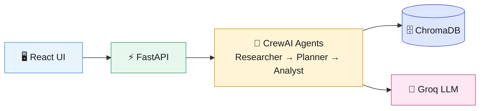

# 🌴 TripSmith: Workflow

```mermaid
flowchart LR
    UI["🖥️ React UI"] --> API["⚡ FastAPI"]
    API --> Crew["🤖 CrewAI Agents<br/>Researcher → Planner → Analyst"]
    Crew --> DB[("🗄️ ChromaDB")]
    Crew --> LLM["🧠 Groq LLM"]

    style UI fill:#e8f4fd,stroke:#4a90d9,color:#1a1a1a
    style API fill:#e6f7ee,stroke:#3aa76d,color:#1a1a1a
    style Crew fill:#fff4d6,stroke:#d4a017,color:#1a1a1a
    style DB fill:#dde6ff,stroke:#4a5fd9,color:#1a1a1a
    style LLM fill:#fde7f3,stroke:#c2538a,color:#1a1a1a
```